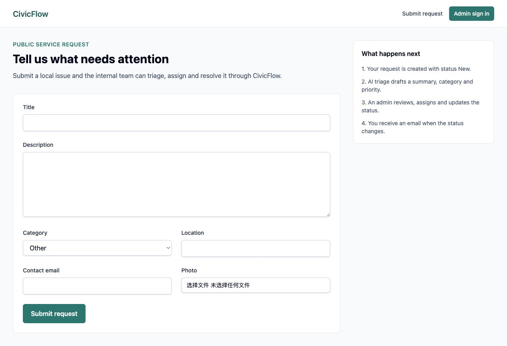
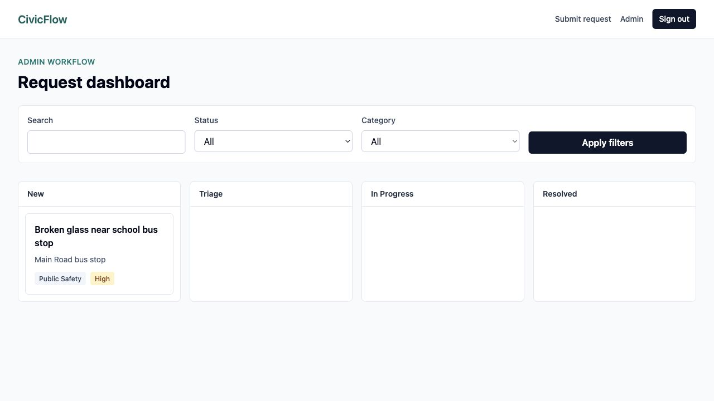
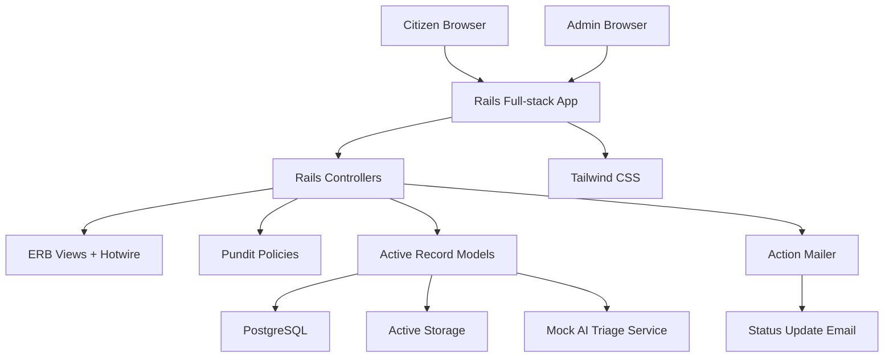
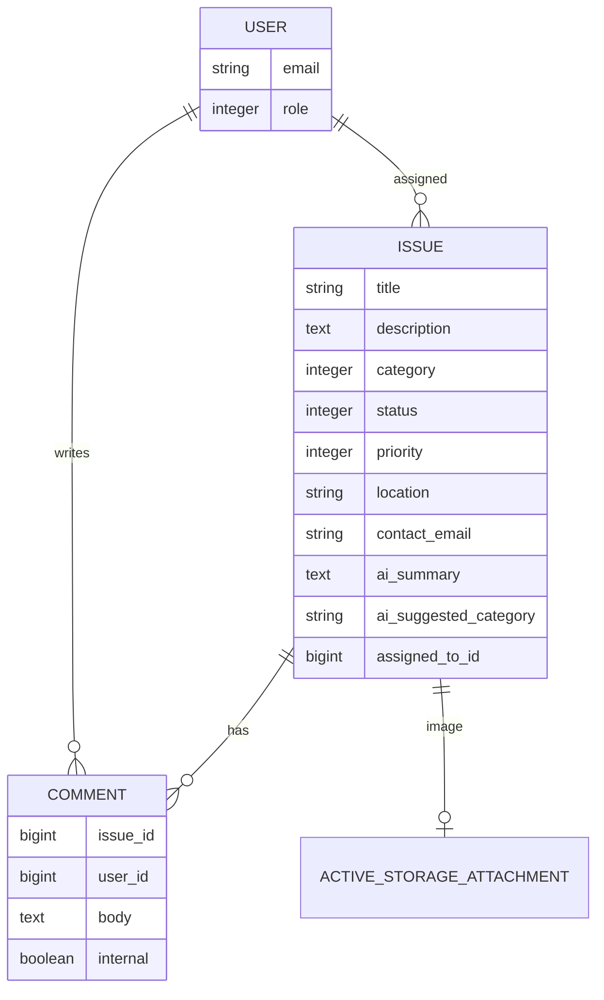

# CivicFlow

**A Rails MVP for citizen service requests and public sector issue triage.**

CivicFlow helps residents report local service issues and gives an internal team a lightweight workflow to triage, assign, update and resolve them. It is built as a production-style Ruby on Rails full-stack application with PostgreSQL, Hotwire, Tailwind, Devise, Pundit, Action Mailer, Active Storage, RSpec, Docker and GitHub Actions.

The product focuses on a practical civic workflow: small enough to understand quickly, but complete enough to show how public submissions become trackable internal service work.

## Product Walkthrough

The screenshots below are ordered as a short product story. They show what each user sees, what action they can take, and why that step matters in a public service workflow.

### 1. Citizen Submits A Service Request

Residents start on a focused submission screen. The form captures the minimum information an internal team needs to triage the issue: title, description, category, location, contact email and an optional photo.

What this demonstrates:

- A citizen-facing workflow that does not require account creation
- Accessible labelled inputs for the core reporting flow
- Active Storage-ready photo upload
- A clear expectation of what happens after submission



User impact:

The resident can quickly report a local problem without needing to understand the internal process. The right-hand panel makes the workflow transparent: submit, triage, assign, update by email.

### 2. Admin Reviews Requests On A Triage Dashboard

Admins see incoming requests grouped by status. The dashboard is designed for scanning: search and filters sit above the work board, while each card shows the request title, location, category and priority.

What this demonstrates:

- Internal workflow management with a Kanban-style status board
- Search and filtering for operational teams
- AI-assisted triage output surfaced as category and priority
- A Rails full-stack admin interface without a separate SPA



User impact:

The internal team can immediately see what is new, what is being triaged, what is in progress and what has been resolved. This turns citizen submissions into actionable service work instead of a static inbox.

## Workflow Walkthrough

Use this path to understand the main product flow:

1. Open the citizen form and submit a realistic issue, for example broken glass near a school bus stop.
2. Confirm the request lands in the system with status `New`.
3. Sign in as an admin.
4. Find the new request on the Kanban dashboard.
5. Open the request and review the AI-generated summary, suggested category and priority.
6. Assign an owner and add an internal note.
7. Move the request to `In Progress`.
8. Confirm a status update email is generated for the submitter.

Demo admin account:

```text
admin@example.com
password123
```

## Why This Project Stands Out

- **Real civic workflow, not a generic CRUD app**: public submission, internal triage, assignment, notes, status updates and email notifications.
- **Rails-native full-stack delivery**: ERB views, Hotwire, Tailwind and Rails conventions keep the app simple, fast and maintainable.
- **Public sector fit**: the domain is service delivery, accessibility, transparency and practical operational tooling.
- **AI used where it helps the workflow**: a deterministic AI triage service summarizes requests and suggests category/priority without making the MVP dependent on an API key.
- **Engineering completeness**: role-based authorization, image uploads, mailers, tests, CI, Docker and a written acceptance checklist.

## Features

### Citizen-Facing Flow

- Submit a service issue with title, description, category, location and contact email
- Upload an optional photo through Active Storage
- Receive a confirmation page after submission
- New requests start in the `New` workflow state

### Admin Workflow

- Secure admin login with Devise
- Pundit authorization for admin-only workflows
- Kanban-style dashboard grouped by:
  - `New`
  - `Triage`
  - `In Progress`
  - `Resolved`
- Search by title or description
- Filter by status and category
- Update status, category, priority and assignee
- Add internal notes that are hidden from citizens
- View uploaded request images

### Notifications And AI

- Action Mailer sends a status update email when the request status changes
- AI triage generates:
  - summary
  - suggested category
  - priority
- AI triage has a safe fallback so issue creation still succeeds if the service fails

## Tech Stack

| Area | Technology |
| --- | --- |
| Framework | Ruby on Rails 7.2 |
| Language | Ruby 3.3 |
| Database | PostgreSQL |
| Frontend | ERB, Hotwire, Turbo, Stimulus |
| Styling | Tailwind CSS |
| Authentication | Devise |
| Authorization | Pundit |
| File Uploads | Active Storage |
| Email | Action Mailer |
| Testing | RSpec |
| CI | GitHub Actions |
| Local Infra | Docker / Docker Compose |

## Architecture



## Data Model



## Local Setup

Prerequisites:

- Ruby 3.3
- PostgreSQL
- Bundler

Install dependencies:

```bash
bundle install
```

Create and seed the database:

```bash
bin/rails db:setup
```

Run the app:

```bash
bin/dev
```

Open:

- Citizen form: http://localhost:3000
- Admin sign in: http://localhost:3000/users/sign_in
- Admin dashboard: http://localhost:3000/admin

## Docker

```bash
docker compose up --build
```

Then open:

```text
http://localhost:3000
```

## Tests

```bash
bundle exec rspec
```

Current coverage includes:

- User role defaults
- Issue validations
- AI triage generation
- Admin authorization
- Dashboard filtering/search
- Status update email behavior
- Internal note creation
- Mailer content

Latest local result:

```text
14 examples, 0 failures
```

## CI

GitHub Actions runs:

- PostgreSQL service
- `bin/rails db:prepare`
- `bundle exec rspec`
- `bin/brakeman --no-pager --no-exit-on-warn`

## AI Triage

The MVP currently uses a deterministic mock service:

```text
app/services/ai_triage_service.rb
```

This keeps the AI workflow visible and testable without requiring an API key. A production version could replace this with an OpenAI-backed service for summarization, categorization and priority scoring.

## Project Structure Highlights

```text
app/controllers/admin        Admin dashboard, issue updates and internal notes
app/models                   User, Issue and Comment domain models
app/policies                 Pundit authorization policies
app/services                 AI triage service
app/mailers                  Status update email
spec                         RSpec model, request, mailer and service tests
docs/screenshots             README screenshots
MVP_ACCEPTANCE_CRITERIA.md   Feature acceptance checklist
```

## Acceptance Criteria

The MVP is backed by a dedicated feature acceptance checklist:

[MVP_ACCEPTANCE_CRITERIA.md](MVP_ACCEPTANCE_CRITERIA.md)

## Future Improvements

- Replace mock AI triage with a real OpenAI integration
- Add public request tracking links
- Add map-based location selection
- Add SLA / overdue indicators
- Add CSV export for admin reporting
- Add Sidekiq for background email delivery
- Deploy to Render, Fly.io or AWS
